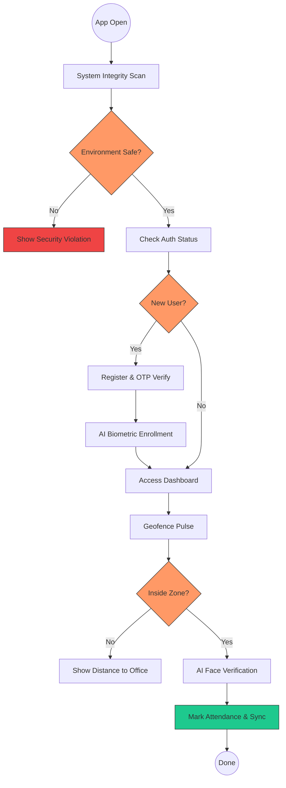
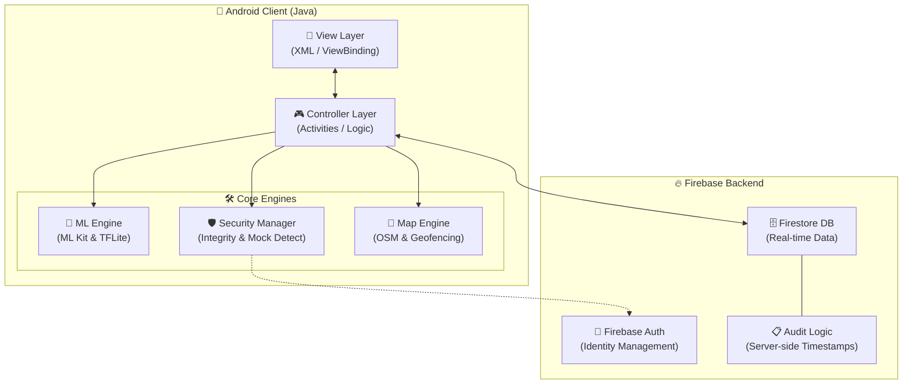

# 📍 GeoAttend: Geofenced Attendance with On-Device Face Verification

[](https://github.com/Saimanoj2325/GeoAttend)
[](https://github.com/Saimanoj2325/GeoAttend)
[](https://github.com/Saimanoj2325/GeoAttend)

GeoAttend is an Android attendance app that combines **geofencing**, **on-device face verification**, and **device-integrity checks** (root/mock-location/ADB detection) to reduce common attendance-fraud vectors — buddy punching, GPS spoofing, and photo-based spoofing of check-ins.

Built solo as a personal project. Core security and ML logic is implemented and functional; see [Status](#-current-status) below for what's solid vs. still in progress.

## 🎥 Demo

<p align="center">
  
</p>

<p align="center">
  <em>Check In and Check out in GeoAttend with Face Verification</em>
</p>


## 🛡️ Security Approach

GeoAttend treats the client device as untrusted by default and layers several checks before allowing an attendance event:

* **Integrity Scan**: Checks for root indicators (su binaries, build tags) and USB debugging (ADB) on startup.
* **Mock-Location Scoring**: Weighted risk score combining Android's mock-provider API, developer-options state, and GPS provider type — not a single binary check.
* **Biometric Liveness**: Randomized challenges (blink/smile/turn head) before face capture, to make static-photo spoofing harder.
* **Device Binding**: Device fingerprinting to discourage one account being shared across devices.

### 📍 Geofencing
* Circular and polygonal zone definitions using OpenStreetMap (OSMDroid) — no Google Maps API key required.
* Background service triggers auto-checkout when a device exits the defined zone.
* UI surfaces GPS accuracy/confidence before allowing check-in, rather than trusting raw coordinates blindly.

### 🎭 On-Device Face Verification
* Uses Google ML Kit for face detection and a MobileFaceNet TFLite model for generating face embeddings, compared via Euclidean distance.
* Embeddings (vectors), not raw photos, are what gets stored — reduces (but doesn't by itself guarantee compliance with) biometric data exposure.
* Runs fully on-device — no network round-trip needed for the match itself.

---

## 🗺️ System Workflow



---

## 🏗️ Technical Architecture



---

## 🛠️ Tech Stack

* **Language**: Java (Android SDK 34 target)
* **On-Device AI**: Google ML Kit (face detection) + TensorFlow Lite (MobileFaceNet embeddings)
* **Database**: Firebase Firestore
* **Auth**: Firebase Auth
* **Maps**: OSMDroid (OpenStreetMap)
* **UI**: Material 3 components

---

## 📌 Current Status

What's implemented and working:
- Root / ADB / mock-location detection (`SecurityManager.java`) — layered checks, not stubs.
- On-device face embedding generation and comparison via MobileFaceNet (`FaceRecognitionProcessor.java`).
- Geofence definition, entry/exit detection, and auto-checkout flow.
- Firebase-backed attendance logging with server timestamps.

What's still in progress:
- `getIntegrityVerdict()` is a placeholder for Play Integrity API integration — not yet wired to a backend verification step.
- Liveness-challenge UX (blink/smile/turn) is implemented but not yet evaluated against video-replay spoofing attempts.
- No performance benchmarking has been done yet (frame rate, embedding latency on low-end devices).
- App screenshots/demo video not yet added to this README.

I'd rather list what's actually done than oversell the rest — happy to walk through any of the above in more detail.

---

## 🚀 Getting Started

1. Clone this repository.
2. Add your `google-services.json` to the `app/` directory (from Firebase Console).
3. Create a `local.properties` file with SMTP credentials for the OTP flow:
    ```properties
    smtp.email=your-email@example.com
    smtp.password=your-app-password
    ```
4. Build and run on a **physical Android device** — GPS and camera behavior is unreliable on emulators for this app's purposes.

---

## 📁 Project Structure

* `com.geoattend.employee` — Dashboard, face verification, profile
* `com.geoattend.admin` — Geofence management, security center, analytics
* `com.geoattend.model` — Data models (`AttendanceRecord`, `GeofenceItem`, `User`)
* `com.geoattend.utils` — Security, geofencing, and ML processing logic
* `com.geoattend.service` — Background services (geofence broadcast, FCM)

---

*Built solo by [Saimanoj2325](https://github.com/Saimanoj2325). Feedback on architecture and security approach welcome.*
