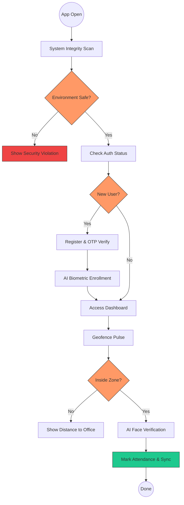
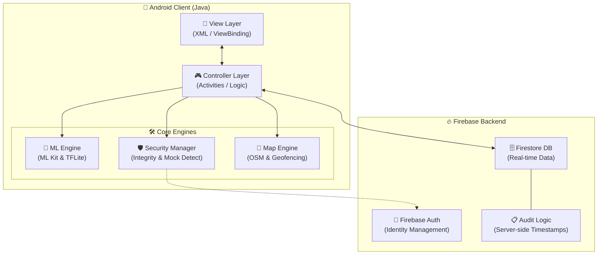

# 📍 GeoAttend: AI-Powered Secure Workforce Management

GeoAttend is a "Zero-Trust" attendance ecosystem designed for the modern hybrid workspace. It leverages **On-Device Machine Learning**, **Precision Geofencing**, and **System Integrity Gates** to eliminate attendance fraud while preserving user privacy.

---

## 📽️ Product Showcase (Demo)

  
  
<i>Full workflow: Integrity Scan → Secure Login → Biometric Verification → Attendance Logged</i>

---

## 🛡️ "Zero-Trust" Security Philosophy
Unlike standard apps, GeoAttend assumes the device environment is hostile until proven otherwise.
*   **Integrity Gate**: Mandatory scan for Root access and USB Debugging (ADB) on startup.
*   **Mock GPS Defense**: Multi-layer risk scoring to identify and block location spoofing.
*   **Biometric Liveness**: Random AI-driven liveness challenges (Blink/Smile/Turn) to prevent deepfake/photo attacks.
*   **Hard-Binding**: High-entropy device fingerprinting to ensure account integrity.

### 📍 Precision Geofencing (OSM)
*   **Adaptive Boundaries**: Dynamic circular and polygonal zones using OpenStreetMap (OSMDroid).
*   **Auto-Checkout**: Intelligent background services that trigger checkout if the device exits the secure zone.
*   **Signal Weighting**: A "Confidence Chip" UI that evaluates GPS accuracy before allowing Check-In.

### 🎭 Privacy-First AI
*   **TFLite Embeddings**: Face biometric data is converted into high-dimensional vectors on-device. No actual photos are stored in the cloud.
*   **Local Processing**: Zero-latency biometric verification even with poor internet connectivity.

---

## 🗺️ System Workflow

---

## 🏗️ Technical Architecture

---

## 🛠️ Tech Stack

*   **Logic**: Java (Android SDK 34 target)
*   **Local AI**: Google ML Kit (Face Detection) + TensorFlow Lite (MobileFaceNet)
*   **Database**: Firebase Firestore (NoSQL)
*   **Maps**: OSMDroid (OpenStreetMap)
*   **Threading**: RxJava/Concurrency for ML processing
*   **UI/UX**: Material 3 Design System with custom animations

---

## 📝 Technical Reviewer Notes
During the development, several architectural decisions were made to prioritize security:
*   **State Machine Verification**: The Face Verification process uses a strict state machine to prevent race conditions during frame analysis.
*   **Environment Guarding**: A mandatory integrity scan prevents usage on compromised (Rooted/ADB-enabled) devices.
*   **On-Device Priority**: Biometric matching is performed locally to ensure data privacy and zero-latency performance.

---

## 🚀 Getting Started

1.  Clone this repository.
2.  Add your `google-services.json` to the `app/` folder.
3.  Build and run on a **physical Android device** (GPS and Camera accuracy is required).

---
*Created with a focus on Security, Performance, and Precision.*
