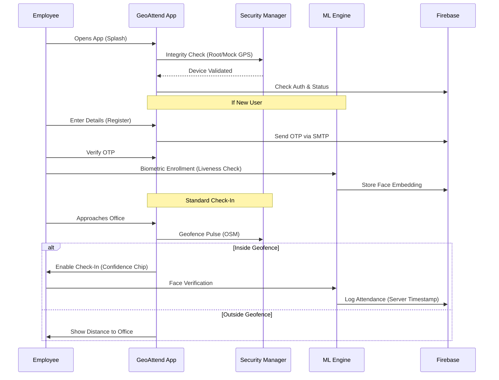
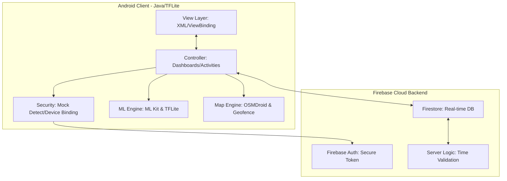

# 📍 GeoAttend: AI-Powered Secure Workforce Management

[](https://github.com/yourusername/geoattend)
[](https://github.com/yourusername/geoattend)
[](README_TESTING.md)
[](https://github.com/yourusername/geoattend)

GeoAttend is a "Zero-Trust" attendance ecosystem designed for the modern hybrid workspace. It leverages **On-Device Machine Learning**, **Precision Geofencing**, and **System Integrity Gates** to eliminate attendance fraud while preserving user privacy.

---

## 🛡️ "Zero-Trust" Security Philosophy
Unlike standard apps, GeoAttend assumes the device environment is hostile until proven otherwise.
*   **Integrity Gate**: Mandatory scan for Root access and USB Debugging (ADB) on startup.
*   **Mock GPS Defense**: Multi-layer risk scoring to identify and block location spoofing.
*   **Biometric Liveness**: Random AI-driven challenges (Blink/Smile/Turn) to prevent deepfake/photo attacks.
*   **Hard-Binding**: High-entropy device fingerprinting to prevent account sharing.

### 📍 Precision Geofencing (OSM)
*   **Adaptive Boundaries**: dynamic circular and polygonal zones using OpenStreetMap (OSMDroid).
*   **Auto-Checkout**: Intelligent background services that trigger checkout if the device exits the secure zone.
*   **Signal Weighting**: A "Confidence Chip" UI that evaluates GPS accuracy before allowing Check-In.

### 🎭 Privacy-First AI
*   **TFLite Embeddings**: Face biometric data is converted into high-dimensional vectors on-device. No actual photos are stored in the cloud, ensuring GDPR/CCPA compliance.
*   **Local Processing**: Zero-latency verification even with poor internet connectivity.

---

## 📸 App Interface (Mockups)

| **Smart Dashboard** | **AI Biometric Scan** | **Admin Control Center** |
|:---:|:---:|:---:|
|  |  |  |
| *Real-time proximity UI & session timer* | *On-device face verification* | *Global analytics & zone management* |

---

## 🗺️ User Journey & System Flow



---

## 🏗️ Technical Architecture



---

## 🛠️ Tech Stack

*   **Logic**: Java (Android SDK 34 target)
*   **Local AI**: Google ML Kit (Face Detection) + TensorFlow Lite (MobileFaceNet)
*   **Database**: Firebase Firestore (NoSQL)
*   **Maps**: OSMDroid (OpenStreetMap) for open-source map integration
*   **Threading**: RxJava/Concurrency for ML processing
*   **UI/UX**: Material 3 Design System with custom animations (Scale-bounce/Fade)

---

## 📋 Hiring Manager Fast-Track (The "Why Hire Me")
Building this project demonstrated mastery in:
1.  **System Design**: Orchestrating complex interactions between Location APIs, Camera hardware, and Cloud databases.
2.  **Security Engineering**: Thinking like an attacker to build defenses against GPS spoofing and biometric fraud.
3.  **Performance Optimization**: Running ML models and real-time map rendering at 60FPS on-device.
4.  **Product Mindset**: Designing a premium, intuitive UI that balances security with a seamless user experience.

---

## 🚀 Getting Started

1.  Clone this repository.
2.  Add your `google-services.json` to the `app/` folder.
3.  Create a `local.properties` file with your SMTP credentials for the OTP system:
    ```properties
    smtp.email=your-email@example.com
    smtp.password=your-app-password
    ```
4.  Build and run on a physical Android device (Recommended for GPS/Camera accuracy).

---
*Created with a focus on Security, Performance, and Precision.*
